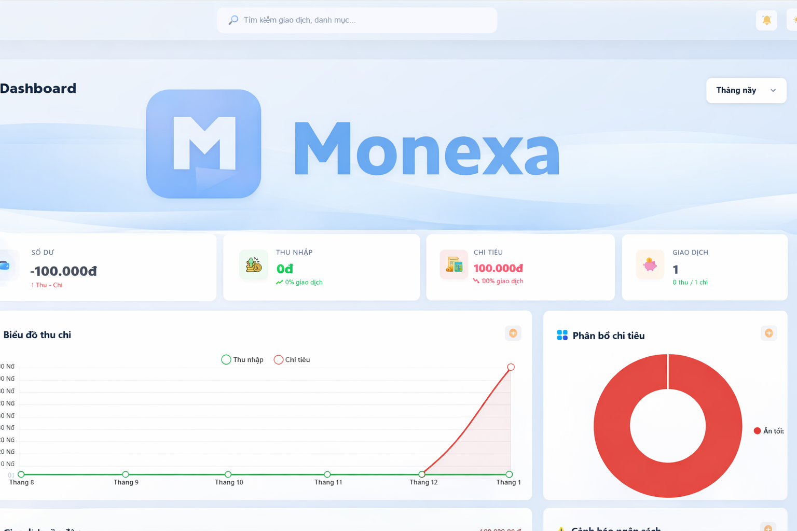
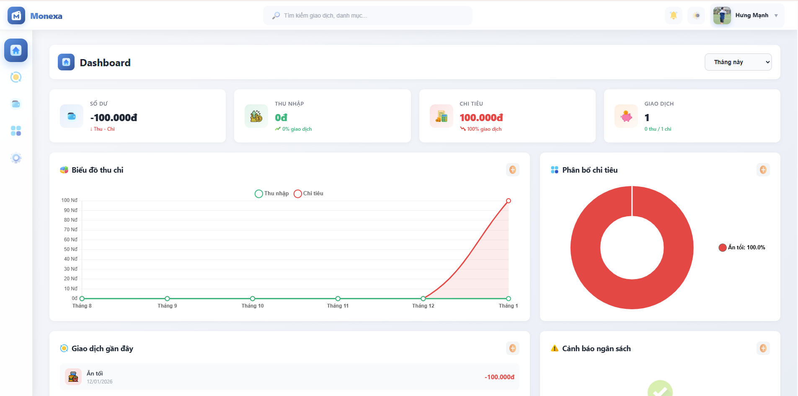
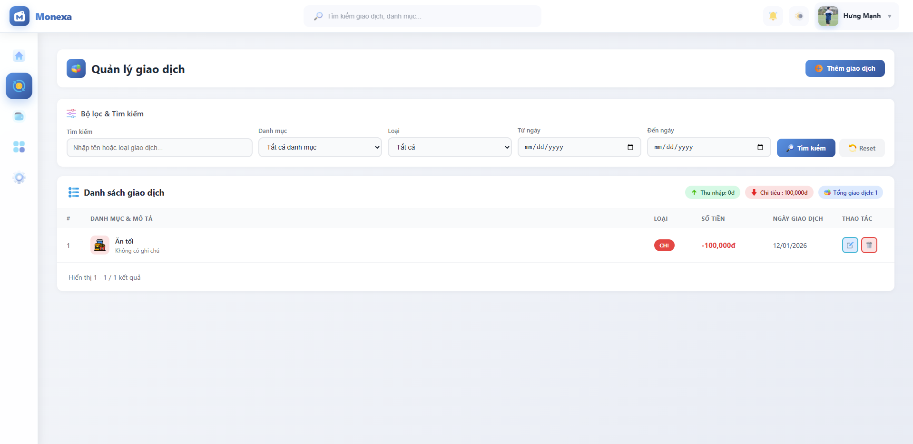
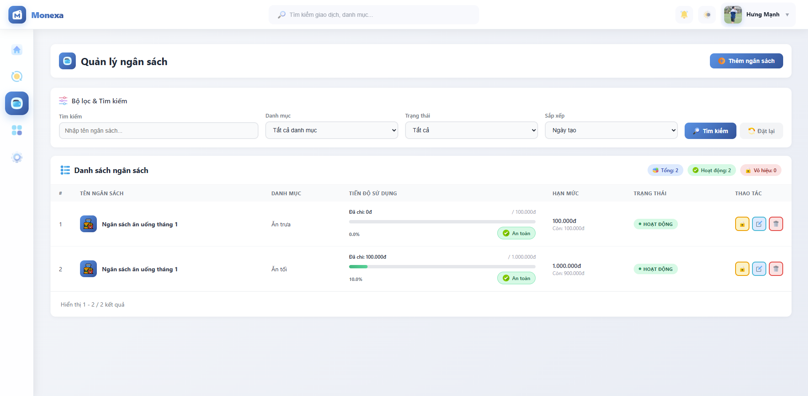
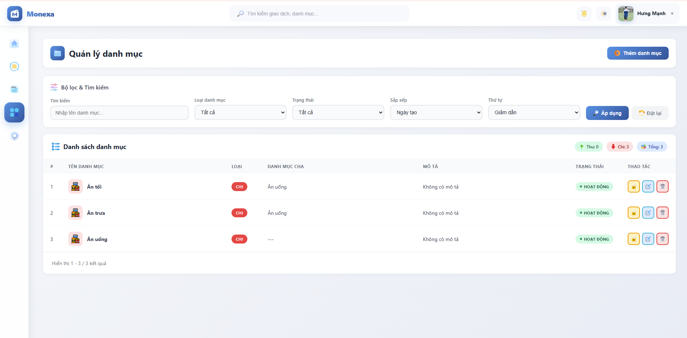

<p align="center">
  
</p>

<p align="center">
  <strong>Ứng dụng Quản lý Chi tiêu Cá nhân</strong>
</p>

<p align="center">
<a href="https://laravel.com"></a>
<a href="https://php.net"></a>
<a href="https://github.com/yourusername/monexa"></a>
<a href="https://github.com/yourusername/monexa/stargazers"></a>
</p>

## Về Monexa

Monexa là ứng dụng web quản lý chi tiêu cá nhân được xây dựng trên nền tảng Laravel. Chúng tôi tin rằng việc quản lý tài chính cá nhân nên đơn giản, trực quan và hiệu quả. Monexa giúp bạn theo dõi thu chi, quản lý ngân sách và phân tích tài chính một cách dễ dàng với các tính năng:

- **Dashboard trực quan** với biểu đồ thời gian thực.
- **Quản lý giao dịch** thu/chi với bộ lọc mạnh mẽ.
- **Quản lý ngân sách** thông minh với cảnh báo vượt mức.
- **Phân loại danh mục** tùy chỉnh với biểu tượng.
- **Xác thực đa dạng** bao gồm Google OAuth.
- **Giao diện responsive** hoạt động mượt mà trên mọi thiết bị.

Monexa được thiết kế để mang lại trải nghiệm quản lý tài chính tốt nhất cho người dùng cá nhân.

## Học Laravel

Laravel có [tài liệu](https://laravel.com/docs) và thư viện video hướng dẫn rộng lớn nhất trong tất cả các framework hiện đại, giúp bạn dễ dàng bắt đầu. Bạn cũng có thể xem [Laravel Learn](https://laravel.com/learn), nơi bạn sẽ được hướng dẫn xây dựng ứng dụng Laravel hiện đại.

Nếu không muốn đọc, [Laracasts](https://laracasts.com) có thể giúp bạn. Laracasts chứa hàng nghìn video hướng dẫn về Laravel, PHP hiện đại, unit testing và JavaScript.

## Cài đặt

### Yêu cầu hệ thống

- PHP >= 8.2
- Composer
- MySQL hoặc MariaDB
- Node.js & NPM

### Các bước cài đặt

Clone repository và cài đặt dependencies:

```bash
git clone https://github.com/scoppy9201/monexa.git
cd monexa
composer install
npm install
```

Tạo file môi trường và generate application key:

```bash
cp .env.example .env
php artisan key:generate
```

Cấu hình database trong file `.env`:

```env
DB_CONNECTION=mysql
DB_HOST=127.0.0.1
DB_PORT=3306
DB_DATABASE=monexa
DB_USERNAME=root
DB_PASSWORD=
```

Chạy migrations và seeders:

```bash
php artisan migrate
php artisan db:seed
```

Tạo symbolic link cho storage:

```bash
php artisan storage:link
```

Khởi động development server:

```bash
php artisan serve
```

Ứng dụng sẽ chạy tại `http://localhost:8000`

## Cấu hình Google OAuth (Tùy chọn)

Để sử dụng tính năng đăng nhập Google, cập nhật thông tin trong `.env`:

```env
GOOGLE_CLIENT_ID=your_google_client_id
GOOGLE_CLIENT_SECRET=your_google_client_secret
GOOGLE_REDIRECT_URI=http://localhost:8000/auth/google/callback
```

## Giao diện

<p align="center">
  
  <br>
  <em>Dashboard với thống kê và biểu đồ tổng quan</em>
</p>

<p align="center">
  
  <br>
  <em>Quản lý giao dịch với bộ lọc nâng cao</em>
</p>

<p align="center">
  
  <br>
  <em>Theo dõi ngân sách và tiến độ chi tiêu</em>
</p>

<p align="center">
  
  <br>
  <em>Quản lý danh mục thu chi</em>
</p>

## Tính năng chính

### 🔐 Xác thực & Bảo mật
- Đăng ký/Đăng nhập với validation
- Đăng nhập qua Google OAuth
- Quản lý profile và đổi mật khẩu
- Bảo mật với middleware

### 💸 Quản lý giao dịch
- CRUD giao dịch thu/chi đầy đủ
- Phân loại theo danh mục
- Lọc theo nhiều tiêu chí
- Phân trang và sắp xếp
- Tích hợp với ngân sách

### 💰 Quản lý ngân sách
- Tạo ngân sách cho từng danh mục
- Cập nhật số dư tự động
- Cảnh báo khi sắp vượt mức
- Progress bar trực quan

### 📊 Dashboard & Báo cáo
- Thống kê tổng quan
- Line Chart thu chi theo tháng
- Pie Chart phân bổ chi tiêu
- Top danh mục chi tiêu
- Giao dịch gần đây

### 🏷️ Quản lý danh mục
- Tạo danh mục thu/chi
- Chọn icon tùy chỉnh
- Kích hoạt/Vô hiệu hóa

## Cấu trúc Database

Monexa sử dụng 4 bảng chính:

- **users** - Thông tin người dùng
- **categories** - Danh mục thu chi
- **wallets** - Ngân sách
- **transactions** - Giao dịch

Chi tiết schema có thể xem trong `database/migrations/`

## Công nghệ sử dụng

Monexa được xây dựng với:

- **[Laravel 12.x](https://laravel.com)** - PHP Framework mạnh mẽ
- **[Chart.js](https://www.chartjs.org/)** - Biểu đồ JavaScript
- **[Laravel Socialite](https://github.com/laravel/socialite)** - OAuth authentication
- **[MySQL](https://www.mysql.com/)** - Hệ quản trị cơ sở dữ liệu

## Đóng góp

Cảm ơn bạn đã quan tâm đến việc đóng góp cho Monexa! Để đóng góp:

1. Fork repository này
2. Tạo branch mới (`git checkout -b feature/AmazingFeature`)
3. Commit changes (`git commit -m 'Add some AmazingFeature'`)
4. Push to branch (`git push origin feature/AmazingFeature`)
5. Mở Pull Request

## Quy tắc ứng xử

Để đảm bảo cộng đồng Monexa thân thiện với tất cả mọi người, vui lòng xem xét và tuân thủ [Quy tắc ứng xử](CODE_OF_CONDUCT.md).

## Lỗ hổng bảo mật

Nếu bạn phát hiện lỗ hổng bảo mật trong Monexa, vui lòng gửi email đến [security@monexa.com](mailto:security@monexa.com). Tất cả các lỗ hổng bảo mật sẽ được xử lý kịp thời.

## Tác giả

**Hung Manh**

- GitHub: [@Manhung](https://github.com/scoppy9201)
- Email: Buimanhhung3105@gmail.com

## Giấy phép

Monexa là phần mềm mã nguồn mở được cấp phép theo [Giấy phép MIT](https://opensource.org/licenses/MIT).

---

<p align="center">
  Made with ❤️ by Hung Manh
</p>

<p align="center">
  <a href="https://github.com/yourusername/monexa/stargazers">⭐ Star</a> •
  <a href="https://github.com/yourusername/monexa/issues">🐛 Report Bug</a> •
  <a href="https://github.com/yourusername/monexa/issues">✨ Request Feature</a>
</p>